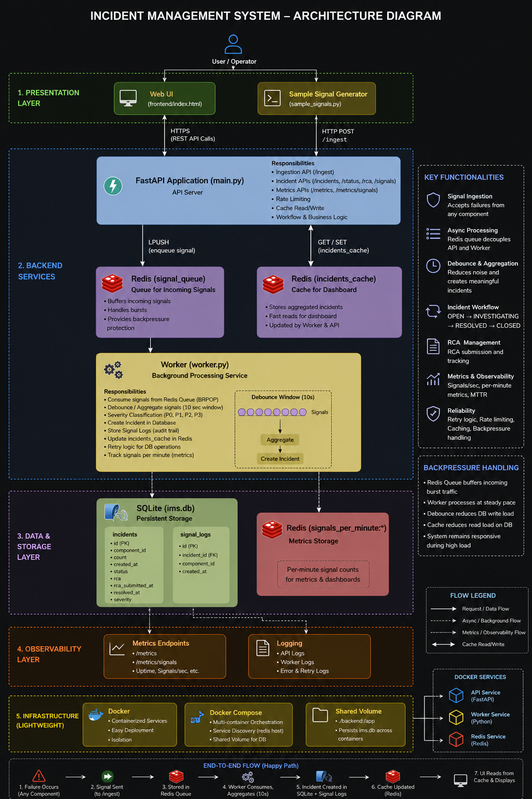

# Distributed Incident Management System

A lightweight distributed Incident Management System (IMS) built using FastAPI, Redis, SQLite, Docker Compose, and a live monitoring dashboard.

The system ingests high-volume failure signals asynchronously, aggregates noisy alerts into incidents using debounce logic, tracks RCA workflows, calculates MTTR, and provides a real-time dashboard for operators.

---

# Architecture Diagram



---

# Features

## Signal Ingestion
- High-throughput async signal ingestion
- Redis queue for buffering incoming signals
- Rate limiting support
- Backpressure handling

## Incident Processing
- Debounce aggregation window (10 seconds)
- Multiple signals grouped into one incident
- Signal-to-incident linkage (audit trail)
- Incident severity classification (P0/P1/P2/P3)

## Workflow Engine
Supported workflow states:

```text
OPEN → INVESTIGATING → RESOLVED → CLOSED
```

* Invalid transitions blocked
* RCA mandatory before closing incidents

## Reliability & Resilience

* Retry logic for DB writes
* Concurrency-safe debounce processing
* Redis cache layer for dashboard performance

## Metrics & Observability

* `/metrics`
* `/metrics/signals`
* `/health`
* MTTR tracking
* Signals-per-minute aggregation

## Frontend Dashboard

* Live incident feed
* Severity visualization
* Incident details
* Linked signals
* RCA submission form
* Status transition controls

## Infrastructure

* Fully containerized using Docker Compose
* Separate API, Worker, and Redis services
* Shared Docker volume for persistence

---

# Tech Stack

| Component        | Technology             |
| ---------------- | ---------------------- |
| Backend API      | FastAPI                |
| Queue            | Redis                  |
| Worker Engine    | Python Threaded Worker |
| Database         | SQLite                 |
| Cache            | Redis                  |
| Frontend         | HTML/CSS/JavaScript    |
| Containerization | Docker Compose         |

---

# Repository Structure

```text
ims-project/

├── backend/
│   ├── main.py
│   ├── worker.py
│   ├── setup_db.py
│   ├── sample_signals.py
│   ├── requirements.txt
│   ├── Dockerfile
│   └── start.sh
│
├── frontend/
│   └── index.html
│
├── docker-compose.yml
├── README.md
└── .gitignore
```

---

# How Backpressure Was Handled

The system uses Redis as a buffering queue between ingestion and processing.

## Problem

During burst traffic, directly writing every incoming signal to the database could overload the system and increase latency.

## Solution

### 1. Redis Queue Buffering

Incoming signals are first pushed into a Redis queue:

```python
r.lpush("signal_queue", json.dumps(signal))
```

This decouples API ingestion from background processing.

---

### 2. Worker-Based Async Processing

A background worker consumes signals asynchronously using:

```python
r.brpop("signal_queue")
```

This ensures the API remains responsive even during traffic spikes.

---

### 3. Debounce Aggregation

Signals arriving within a 10-second window for the same component are grouped into a single incident.

Benefits:

* Reduces database write amplification
* Prevents alert storms
* Creates meaningful incidents instead of noisy events

---

### 4. Redis Cache Layer

Dashboard reads are served from Redis cache instead of hitting SQLite on every request.

Benefits:

* Faster UI responses
* Reduced DB read load

---

### 5. Retry Logic

Database writes use retry logic to handle transient failures gracefully.

---

# Setup Instructions

## Prerequisites

- Docker
- Docker Compose
- Python 3.11 (optional for local scripts)

---

## Dependencies

Python dependencies are listed in:

```text
backend/requirements.txt
```

Main libraries used:

* fastapi
* uvicorn
* redis
* requests

Docker installs dependencies automatically during:

```bash
docker compose up --build
```

For running local scripts manually (like sample_signals.py), install dependencies locally:

```bash
pip install -r backend/requirements.txt
```

---

## Persistent Storage

SQLite database persistence is shared across containers using Docker volumes:

```yaml
volumes:
  - ./backend:/app
```

This ensures both the API and Worker services access the same database state.

---

## Run Using Docker Compose

From project root:

```bash
docker compose up --build
```

This starts:

* FastAPI API
* Worker Service
* Redis

---

## Run Frontend

The frontend is a lightweight static dashboard served separately.

In another terminal:

```bash
cd frontend
python -m http.server 5500
```

Open:

```text
http://localhost:5500
```

---

# API Endpoints

## Health

```http
GET /health
```

---

## Ingest Signal

```http
POST /ingest
```

Example:

```json
{
  "component_id": "DB_PRIMARY",
  "error": "connection timeout"
}
```

---

## Get Incidents

```http
GET /incidents
```

---

## Get Linked Signals

```http
GET /incidents/{incident_id}/signals
```

---

## Update Status

```http
POST /incidents/{incident_id}/status?status=INVESTIGATING
```

---

## Submit RCA

```http
POST /incidents/{incident_id}/rca?rca=RootCause
```

---

## Metrics

```http
GET /metrics
```

```http
GET /metrics/signals
```

---

# Sample Failure Simulation

A sample signal generator is included:

```text
backend/sample_signals.py
```

Run:

```bash
python backend/sample_signals.py
```

This continuously simulates failures across:

* Database
* API Gateway
* Cache Layer
* Queue System
* Authentication Service

---

# Severity Classification

| Component Type | Severity |
| -------------- | -------- |
| DB             | P0       |
| API / MCP      | P1       |
| CACHE / QUEUE  | P2       |
| Others         | P3       |

---

# MTTR Calculation

MTTR is calculated as:

```text
RCA Submission Time - Incident Creation Time
```

---

# Author

Manik Singhal
